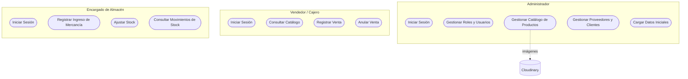

# Documento de Casos de Uso — Sistema SportZone

## 1. Introducción

Este documento describe, a nivel general, los casos de uso del backend de **SportZone**, un sistema de punto de venta (POS) e inventario para una tienda de artículos deportivos. Los casos de uso están agrupados por módulo funcional y reflejan las capacidades reales del sistema.

### 1.1. Alcance

Cubre los 9 módulos del backend: Autenticación, Usuarios y Roles, Catálogo de Productos, Gestión de Imágenes, Terceros (Proveedores/Clientes), Compras, Ventas, Inventario y Carga Inicial de Datos.

### 1.2. Nota sobre actores

El modelo de actores corresponde al diseño lógico de negocio del caso de estudio. La restricción técnica de acceso por rol está planificada para una fase posterior del proyecto.

---

## 2. Actores del Sistema

| Actor | Rol en el sistema |
|---|---|
| **Administrador** | Configura el sistema: roles, usuarios, catálogo de productos, proveedores, clientes y carga inicial de datos. |
| **Vendedor / Cajero** | Opera el punto de venta: consulta el catálogo y registra o anula ventas. |
| **Encargado de Almacén** | Gestiona el inventario: registra compras a proveedores, ajusta stock y consulta su trazabilidad. |
| **Cloudinary** *(sistema externo)* | Almacena y entrega las imágenes de productos y marcas. |

---

## 3. Diagrama General de Casos de Uso por Actor

---

## 4. Resumen de Casos de Uso por Módulo

| Código | Caso de Uso | Módulo |
|---|---|---|
| CU-01 | Iniciar Sesión | Autenticación |
| CU-02 | Gestionar Roles | Usuarios y Roles |
| CU-03 | Gestionar Usuarios | Usuarios y Roles |
| CU-04 | Gestionar Categorías | Catálogo de Productos |
| CU-05 | Gestionar Marcas | Catálogo de Productos |
| CU-06 | Gestionar Artículos | Catálogo de Productos |
| CU-07 | Gestionar Variantes de Artículo | Catálogo de Productos |
| CU-08 | Subir Imagen a la Nube | Gestión de Imágenes |
| CU-09 | Gestionar Proveedores | Gestión de Terceros |
| CU-10 | Gestionar Clientes | Gestión de Terceros |
| CU-11 | Registrar Ingreso de Mercancía | Compras |
| CU-12 | Registrar Venta | Ventas (POS) |
| CU-13 | Anular Venta | Ventas (POS) |
| CU-14 | Consultar Movimientos de Stock | Inventario |
| CU-15 | Cargar Datos Iniciales | Carga Inicial de Datos |

---

## 5. Módulo 1: Autenticación

### CU-01: Iniciar Sesión

| Campo | Detalle |
|---|---|
| **Actor** | Todos los actores internos |
| **Descripción** | El usuario se autentica con email y contraseña y recibe un token de acceso para usar el resto del sistema. |
| **Precondición** | El usuario debe estar registrado y activo. |
| **Flujo Básico** | 1. El actor envía sus credenciales. 2. El sistema las valida. 3. El sistema entrega un token de sesión. |
| **Postcondición** | El actor queda autenticado para el resto de sus operaciones. |

---

## 6. Módulo 2: Usuarios y Roles

### CU-02: Gestionar Roles

| Campo | Detalle |
|---|---|
| **Actor** | Administrador |
| **Descripción** | Alta, consulta, modificación y eliminación de los roles que se asignan a los usuarios (ej. Vendedor, Almacén). |
| **Precondición** | Ninguna para crear/listar; el rol debe existir para modificar o eliminar. |
| **Flujo Básico** | 1. El actor registra o edita un rol. 2. El sistema valida que el nombre no esté repetido. 3. El sistema guarda el cambio. |
| **Postcondición** | El catálogo de roles queda disponible para asignarse a usuarios. |

### CU-03: Gestionar Usuarios

| Campo | Detalle |
|---|---|
| **Actor** | Administrador |
| **Descripción** | Alta, consulta, modificación y eliminación de las cuentas de acceso al sistema, cada una con un rol asignado. |
| **Precondición** | El rol asignado debe existir; el email no debe estar ya registrado. |
| **Flujo Básico** | 1. El actor registra al usuario con su rol. 2. El sistema valida el email y protege la contraseña. 3. El sistema crea la cuenta. |
| **Postcondición** | El usuario queda habilitado para iniciar sesión (CU-01). |

---

## 7. Módulo 3: Catálogo de Productos

### CU-04: Gestionar Categorías

| Campo | Detalle |
|---|---|
| **Actor** | Administrador |
| **Descripción** | Mantenimiento de las categorías en que se clasifican los artículos (ej. Fútbol, Running). |
| **Precondición** | La categoría debe existir para modificarla o eliminarla. |
| **Flujo Básico** | 1. El actor registra o edita una categoría. 2. El sistema valida unicidad del nombre. 3. El sistema guarda el cambio. |
| **Postcondición** | La categoría queda disponible para clasificar artículos. |

### CU-05: Gestionar Marcas

| Campo | Detalle |
|---|---|
| **Actor** | Administrador |
| **Descripción** | Mantenimiento de las marcas de los artículos, incluyendo su logo. |
| **Precondición** | La marca debe existir para modificarla o eliminarla. |
| **Flujo Básico** | 1. El actor sube el logo (CU-08) y registra o edita la marca. 2. El sistema valida unicidad del nombre. 3. El sistema guarda el cambio. |
| **Postcondición** | La marca queda disponible para asociarse a artículos. |

### CU-06: Gestionar Artículos

| Campo | Detalle |
|---|---|
| **Actor** | Administrador |
| **Descripción** | Mantenimiento del catálogo general de artículos (el modelo del producto), cada uno asociado a una categoría y una marca. El precio y el stock se manejan a nivel de variante (CU-07). |
| **Precondición** | La categoría y la marca referenciadas deben existir. |
| **Flujo Básico** | 1. El actor sube la imagen (CU-08) y registra o edita el artículo. 2. El sistema valida el código y las referencias. 3. El sistema guarda el cambio. |
| **Postcondición** | El artículo queda disponible para crearle variantes (CU-07). |

### CU-07: Gestionar Variantes de Artículo

| Campo | Detalle |
|---|---|
| **Actor** | Administrador, Vendedor/Cajero, Encargado de Almacén |
| **Descripción** | Mantenimiento de las combinaciones de talla/color de un artículo, cada una con su propio precio, costo, stock e imagen. Incluye la búsqueda de una variante por código de barras, la consulta de variantes con stock bajo, y el ajuste manual de stock tras un conteo físico. |
| **Precondición** | El artículo padre debe existir. |
| **Flujo Básico** | 1. El actor registra, edita o consulta variantes del artículo. 2. El sistema valida la combinación talla/color y el código de barras. 3. El sistema guarda o devuelve la información solicitada. |
| **Postcondición** | La variante queda disponible para comprarse (CU-11) o venderse (CU-12). |

---

## 8. Módulo 4: Gestión de Imágenes

### CU-08: Subir Imagen a la Nube

| Campo | Detalle |
|---|---|
| **Actor** | Administrador; Cloudinary (sistema externo) |
| **Descripción** | Endpoint genérico que sube una imagen al servicio externo Cloudinary y devuelve su URL pública, para usarse luego en artículos, marcas o variantes. |
| **Precondición** | El archivo debe ser una imagen válida (JPEG/PNG/WEBP) de hasta 5 MB. |
| **Flujo Básico** | 1. El actor envía el archivo. 2. El sistema lo valida y lo envía a Cloudinary. 3. Cloudinary devuelve la URL pública. |
| **Postcondición** | La imagen queda disponible públicamente para asociarse a un registro del catálogo. |

---

## 9. Módulo 5: Gestión de Terceros

### CU-09: Gestionar Proveedores

| Campo | Detalle |
|---|---|
| **Actor** | Administrador |
| **Descripción** | Mantenimiento de los proveedores a quienes se les compra mercancía. |
| **Precondición** | El proveedor debe existir para modificarlo o eliminarlo. |
| **Flujo Básico** | 1. El actor registra o edita un proveedor. 2. El sistema valida unicidad del nombre. 3. El sistema guarda el cambio. |
| **Postcondición** | El proveedor queda disponible para asociarse a un ingreso de mercancía (CU-11). |

### CU-10: Gestionar Clientes

| Campo | Detalle |
|---|---|
| **Actor** | Administrador, Vendedor/Cajero |
| **Descripción** | Mantenimiento de los clientes que pueden asociarse a una venta (la venta también admite no tener cliente). |
| **Precondición** | El cliente debe existir para modificarlo o eliminarlo. |
| **Flujo Básico** | 1. El actor registra o edita un cliente. 2. El sistema valida que el documento no esté repetido. 3. El sistema guarda el cambio. |
| **Postcondición** | El cliente queda disponible para asociarse a una venta (CU-12). |

---

## 10. Módulo 6: Compras

### CU-11: Registrar Ingreso de Mercancía

| Campo | Detalle |
|---|---|
| **Actor** | Encargado de Almacén |
| **Descripción** | Registra la compra de mercancía a un proveedor, incrementando el stock de cada variante recibida y actualizando su costo vigente. También permite consultar los ingresos ya registrados. |
| **Precondición** | El proveedor y las variantes incluidas deben existir. |
| **Flujo Básico** | 1. El actor registra el ingreso con su detalle de variantes y cantidades. 2. El sistema valida los datos. 3. El sistema incrementa el stock, actualiza el costo y deja constancia del movimiento. |
| **Postcondición** | El stock y el costo de las variantes quedan actualizados, con trazabilidad en el módulo de Inventario (CU-14). |

---

## 11. Módulo 7: Ventas (Punto de Venta)

### CU-12: Registrar Venta

| Campo | Detalle |
|---|---|
| **Actor** | Vendedor/Cajero |
| **Descripción** | Registra la venta de uno o más productos, descontando el stock disponible y dejando constancia del costo de cada uno para poder calcular ganancias. También permite consultar las ventas registradas. |
| **Precondición** | Las variantes vendidas deben tener stock suficiente. |
| **Flujo Básico** | 1. El actor busca el producto y arma el detalle de la venta. 2. El sistema valida stock y calcula el precio real desde el catálogo. 3. El sistema descuenta el stock y registra la venta. |
| **Postcondición** | La venta queda registrada y el stock de las variantes vendidas, descontado. |

### CU-13: Anular Venta

| Campo | Detalle |
|---|---|
| **Actor** | Vendedor/Cajero, Administrador |
| **Descripción** | Revierte una venta ya registrada, reintegrando el stock vendido. |
| **Precondición** | La venta debe existir y no estar ya anulada. |
| **Flujo Básico** | 1. El actor solicita anular la venta. 2. El sistema reintegra el stock de cada variante. 3. El sistema marca la venta como anulada. |
| **Postcondición** | El stock queda reintegrado y la venta no puede anularse de nuevo. |

---

## 12. Módulo 8: Inventario

### CU-14: Consultar Movimientos de Stock

| Campo | Detalle |
|---|---|
| **Actor** | Encargado de Almacén, Administrador |
| **Descripción** | Permite auditar las entradas y salidas de inventario generadas automáticamente por compras y ventas, de forma global o por variante. Es un módulo de solo lectura. |
| **Precondición** | Ninguna. |
| **Flujo Básico** | 1. El actor consulta el historial, opcionalmente filtrado por variante. 2. El sistema devuelve los movimientos registrados. |
| **Postcondición** | Ninguna (operación de consulta). |

---

## 13. Módulo 9: Carga Inicial de Datos

### CU-15: Cargar Datos Iniciales

| Campo | Detalle |
|---|---|
| **Actor** | Administrador |
| **Descripción** | Carga masiva, de uso único, de un archivo predefinido con marcas, categorías, artículos y variantes, para poblar el sistema al desplegarlo por primera vez. |
| **Precondición** | El archivo de datos debe existir y tener una estructura válida. |
| **Flujo Básico** | 1. El actor solicita la carga. 2. El sistema verifica que no haya datos previos. 3. El sistema inserta la información base. |
| **Postcondición** | El catálogo base queda disponible para el resto de los módulos. |
