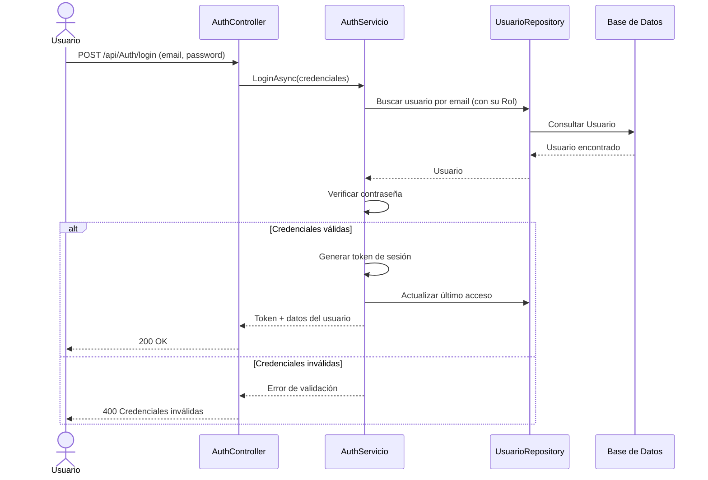
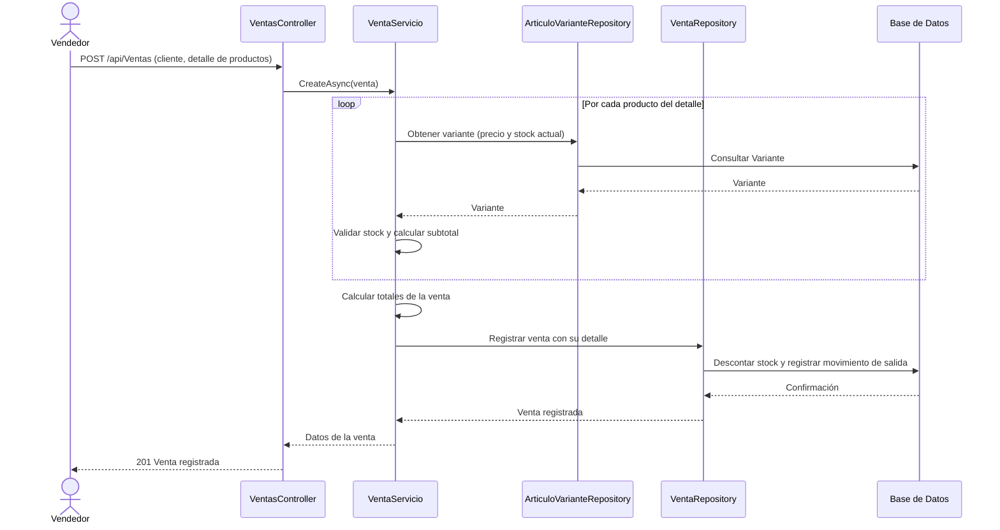
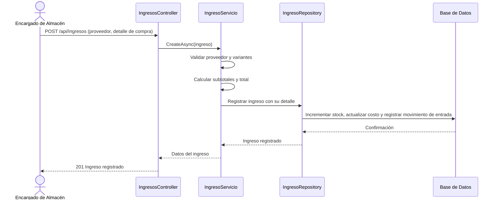
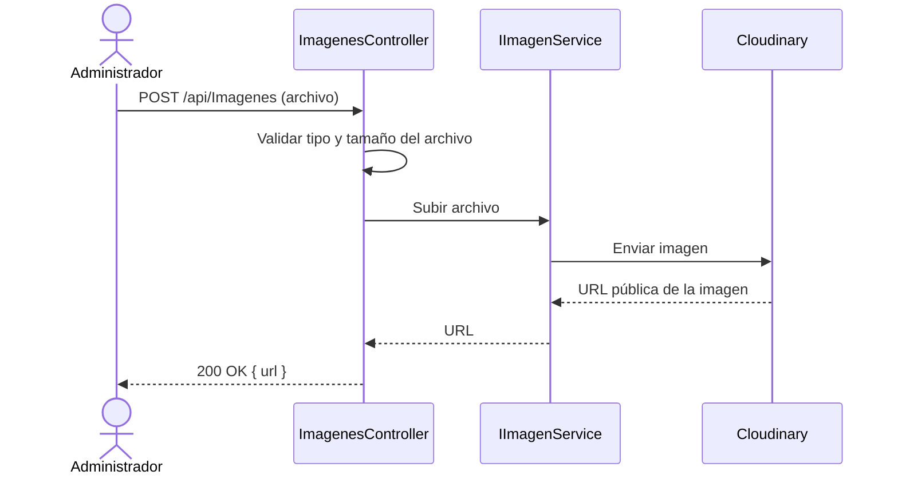
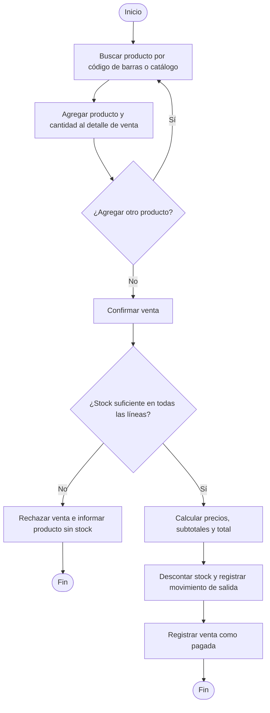
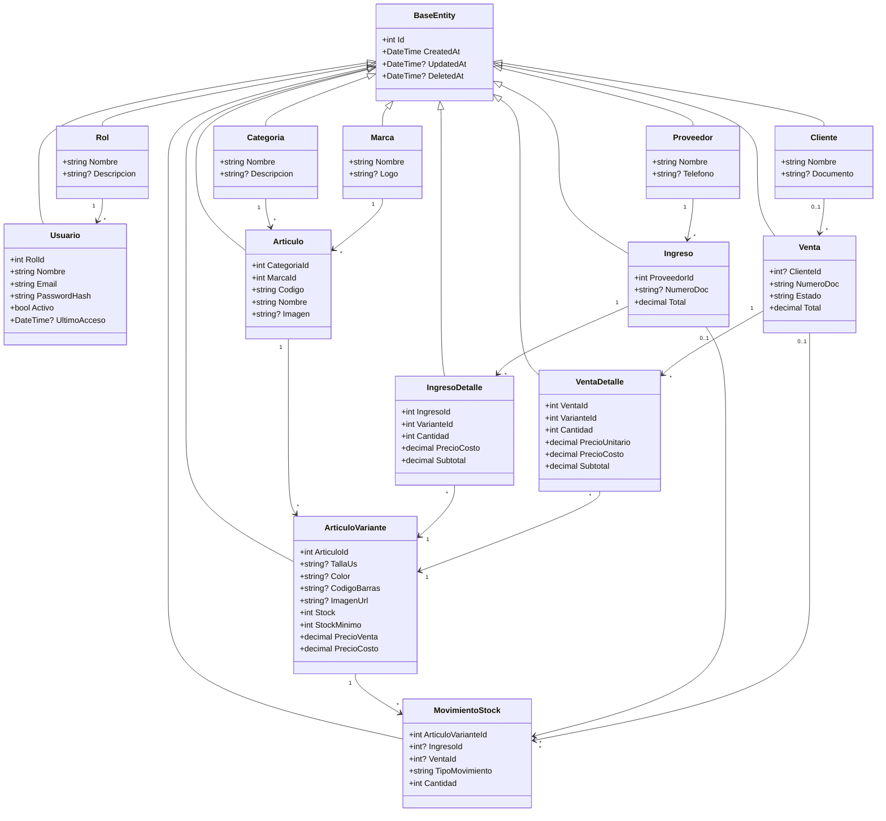

# Diagramas UML — Sistema SportZone

Este documento complementa a `CASOS_DE_USO.md` con la representación gráfica del comportamiento y la estructura del sistema: diagramas de secuencia de los flujos más representativos, un diagrama de actividades del proceso central de venta, y el diagrama de clases del modelo de dominio.

---

## 1. Diagramas de Secuencia

Se representan los cuatro flujos más representativos del sistema: autenticación, el proceso de venta, el proceso de compra y la interacción con el servicio externo de imágenes.

### 1.1. CU-01: Iniciar Sesión

### 1.2. CU-12: Registrar Venta

### 1.3. CU-11: Registrar Ingreso de Mercancía

### 1.4. CU-08: Subir Imagen a la Nube

---

## 2. Diagrama de Actividades

### 2.1. Proceso de Venta

Describe, a alto nivel, el flujo completo de una venta en el punto de venta, desde la búsqueda del producto hasta el registro final.

---

## 3. Diagrama de Clases

### 3.1. Modelo de Dominio

Representa las entidades principales del sistema y sus relaciones. Todas las entidades heredan de `BaseEntity`, que centraliza el identificador y la auditoría (creación, modificación y eliminación lógica).

